# Dynamic Ad Placement Tutorial


## Overview
Rewarded and Interstitial Ads are typically hardcoded to appear at certain places (placements) in a game. This tutorial demonstrates how to use deltaDNA Event Triggered Campaigns to personalise the configuration of Rewarded Ads remotely. 

You will learn how to: 

- Go beyond fixed, hardcoded placements and use the events your players are generating whilst playing to trigger Ads anywhere in your game. 
- Change the value of the rewards you give the player for watching an Ad.
- Change the frequency and number of Ads per session.
- Make changes remotely without needing to update and re-submit your game each time. 
- A/B Test different Ad configurations.
- Use segmentation to personalise Ad configuration for different player groups.
- Analyse and Report on the impact of different Ad configurations.

The great news is that all of this can be achieved very easily with only a few lines of code.

[Watch the Video below](https://www.youtube.com/watch?v=gTRPqygCJ8Q "Dynamic Ad Placement") to see it in action.
<div align="center">
      <a href="https://www.youtube.com/watch?v=gTRPqygCJ8Q&t=0s">
     
      </a>
    </div>

## Scenarios
This tutorial demonstrates two common scenarios:
1) An A/B Test with two different Ad configurations, to determine the optimal reward value and frequency.
2) A promotion that uses player segmentation to either show Ads to established players or an IAP offer to new players.

## Event Triggered Campaigns
As their name suggests, Event Triggered Campaigns use the events that your player is generating whilst playing to trigger a campaign that performs an action in the game immediately. 

Game Parameter Actions are used to send data to the game, or Image Message Actions to display popup images to the player. This tutorial demonstrates both of these mechanisms. 

Game Parameters will be used to instruct the game to show an Ad and tell it how much to reward the player for watching the Ad.

An Image Message Popup will be used to direct the player to our IAP in the store or to watch an Ad.

## Game Parameters

Three Game Parameters are used in this tutorial to control Ads and IAP:

**adShow** -If the game receives this parameter containing a value of 1 it will show an Ad immediately.

**adRewardValue** - The game uses the value received in this parameter to determine the value of the reward given to the player for watching the Ad.

**realCurrencyAmount** - The game uses the value received in this parameter to increment the players currency balance after making an IAP.

## Code
If you are displaying Ads in your game, it will already contain a line of code that makes a call to an Ad Network's SDK to show an Ad at an appropriate time (the placement). 

In order to support the personalisation techniques described above, all you need to do is to move this line of code from its current position and place it inside of the callback that fires when an Event Triggered Campaign containing game parameters is triggered. 

The following code snippet shows the Game Parameter callback. It checks that the **adShow** parameter is present and set to **1**. It then retrieves and stores the **adRewardValue** and shows the Ad.


```csharp
private void myGameParameterHandler(Dictionary<string, object> gameParameters)
{
    // Parse parameters to remotely control Ads      
    if (gameParameters.ContainsKey("adShow"))
    {
        if (System.Convert.ToInt32(gameParameters["adShow"]) == 1)
        {
            // This line of code was moved to turn fixed placements into dynamic ones
            // Show Ad
            Advertisement.Show(placementId); 

            // Store Ad reward value
            if (gameParameters.ContainsKey("adRewardValue"))
            {
                adRewardValue = System.Convert.ToInt32(gameParameters["adRewardValue"]);
            }
        }
    }
    else if (gameParameters.ContainsKey("realCurrencyAmount"))
    {
        gameManager.ReceiveCurrency(System.Convert.ToInt32(gameParameters["realCurrencyAmount"]));
    }
}
```

The actual rewarding of currency to the player is done inside of a Listener from the Ad Network SDK. It checks that the player has watched enough of the Ad, issues the reward based on the **adRewardValue** retrieved above, then records a deltaDNA event to provide reporting.


```csharp
public void OnUnityAdsDidFinish(string placementId, ShowResult showResult)
{
    bool isAdFinished = false; 

    // Deliver currency reward 
    if(showResult == ShowResult.Finished)
    {
        isAdFinished = true;
        gameManager.ReceiveCurrency(adRewardValue);
            
    }
    // Record event for analytics reporting
    GameEvent adEvent = new GameEvent("adImpression")
            .AddParam("adCompletionStatus", isAdFinished ? "COMPLETED" : "INCOMPLETE")
            .AddParam("adProvider", "Unity Ads")
            .AddParam("placementType", "REWARDED AD")
            .AddParam("placementId", placementId)
            .AddParam("placementType", placementId);

    DDNA.Instance.RecordEvent(adEvent).Run();
}
```
It really is that simple. This code uses Unity Ads, but the technique can be applied to other Ad Networks or Mediators in exactly the same way.

Now that we have the code covered, let's take a look at the remote configuration of the Campaigns and Actions in the deltaDNA platform. 


## Scenario 1 - A/B Test Placement, Reward values and Ad Frequency.

This campaign uses two different Game Parameter Actions in an A/B Test.

* Action 1 - **adShow** = 1, **adRewardValue** = 50
* Action 2 - **adShow** = 1, **adRewardValue** = 100

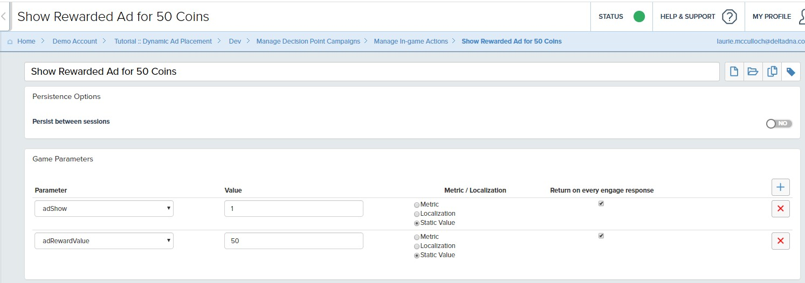
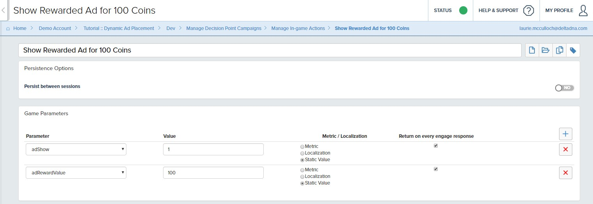

The campaign determines which Action to deliver to the game based on the players test variant assignment. 

### The Event Triggered Campaign is configured with the following settings.

### Details
The campaign is given a name and a description. It has been configured to start immediately and run until we manually stop it.

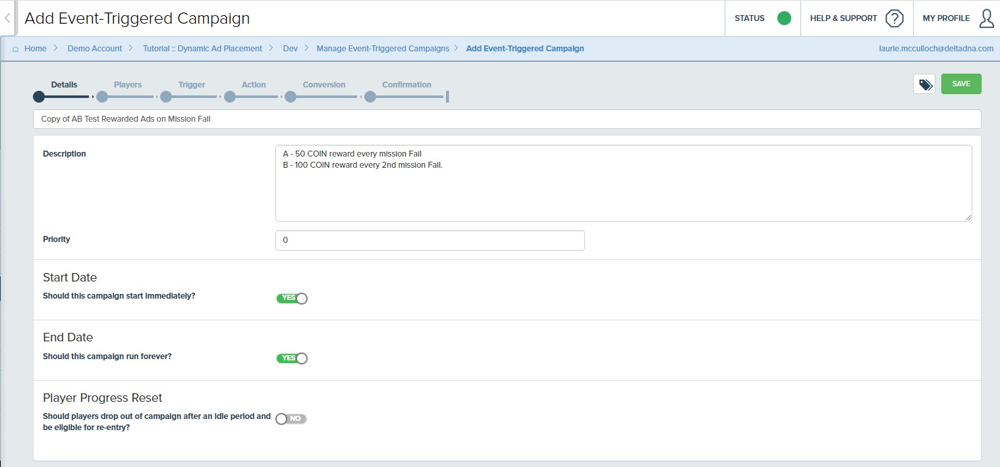

### Players
In this case we are targeting all players, not just a specific player segment.


### Trigger
The campaign is configured to trigger when the player fails a mission. i.e. when they record a **missionFailed** event. We haven't added any specific criteria to the **missionFailed** event, the campaign will be triggered on any mission fail.


### Campaign Actions
There are two Game Parameter Actions in this campaign as it has been configured as an A/B Test.

**Action A - 50 coin reward** will be shown to 50% of the audience **every** time they trigger a **missionFailed** event. 

Notice the *Per-session execution limit* can be used to limit the number of Ads the player sees per session, we haven't put a limit on this.


**Action B - 100 coin reward** will be shown to the remaining 50% of the audience **every 2nd** time they trigger a **missionFailed** event.

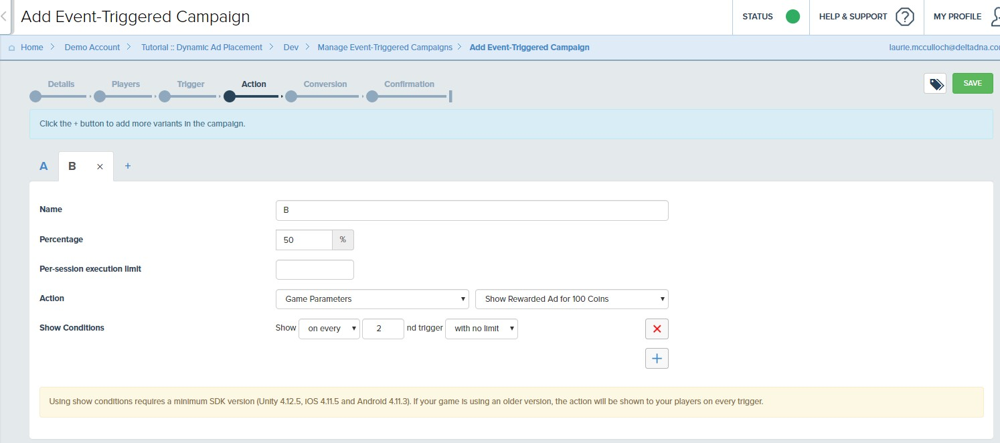

### Conversion Event
A conversion event hasn't been specified in this campaign as we want the campaign to run until we stop it. 

Event Triggered Campaigns generate a **ddnaEventTriggeredAction** event every time a campaign is triggered. This can be used to measure the impact of a campaign on revenue, retention or any other game performance metric. 

 

### Confirmation
The confirmation page shows the campaign details, so they can be checked before testing the campaign on QA devices or publishing it.

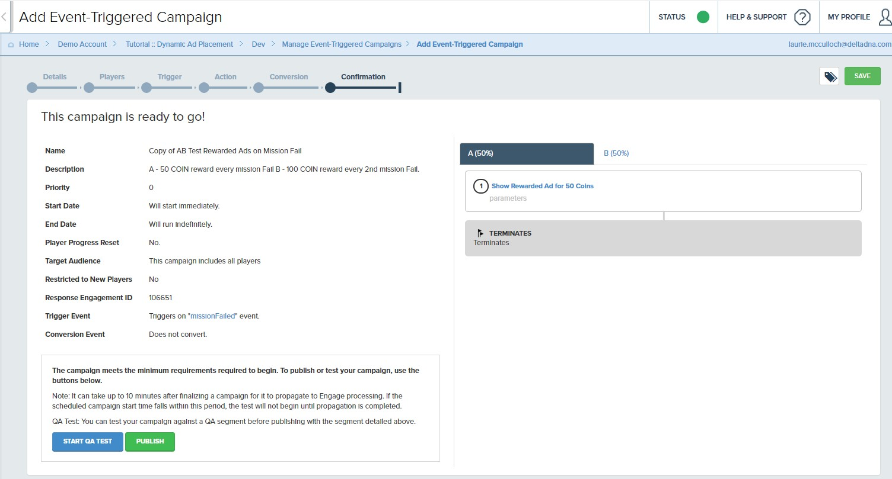


## Scenario 2 - IAP Promo or Rewarded Ad based on player Segment.

This scenario uses two different campaigns, each targeting a different player segment. They also differ from the previous campaign as they use Image Message Popups that contain Game Parameters. 

However, in both cases these campaigns are triggered when the player records an **outOfCoins** event, signifying that they have attempted to start the game, but don't have enough coins. 


### Campaign 1 - Rewarded Ads for established non-spenders.
Targets the **Established Players** player segment.

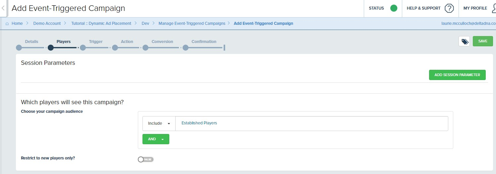

This is defined in the *Engage > Segmentation* tool as players with a first game session more than 3 days ago.

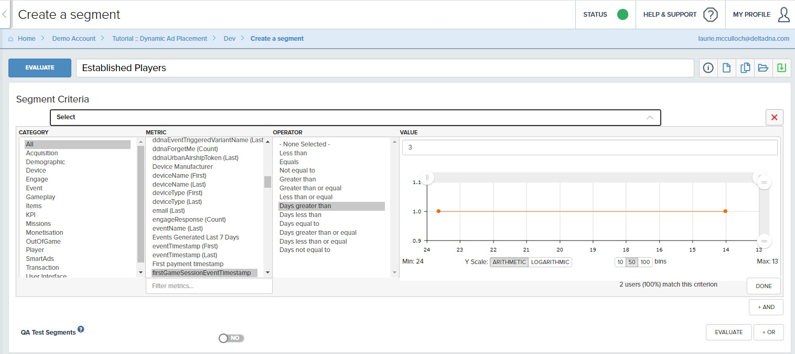

They will be shown an Image Message Popup encouraging them to watch a Rewarded Ad in order to receive some more coins.

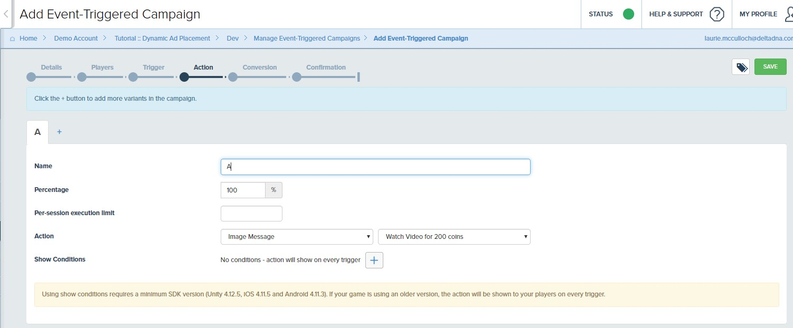

The Image Message Popup contains an image and a button that have been uploaded to deltaDNA. It has been configured to pass an action named "Watch Video" to the Image Message Callback, or dismiss the popup if the player clicks the image background. 


It also contains a Game Parameters block that instructs the game to display an Ad and specifies the reward value.


The campaign confimation page looks like this. 

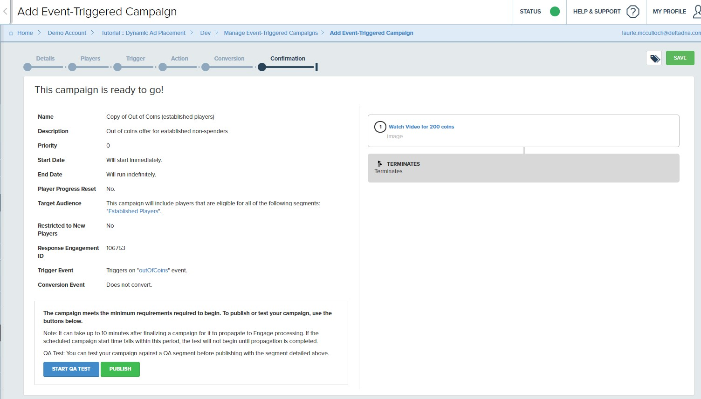


### Campaign 2 - New Player IAP promo bundle.
Targets the **New Players** player segment.


This is defined in the *Engage > Segmentation* tool as players with a first game session less than or equal to 3 days ago.

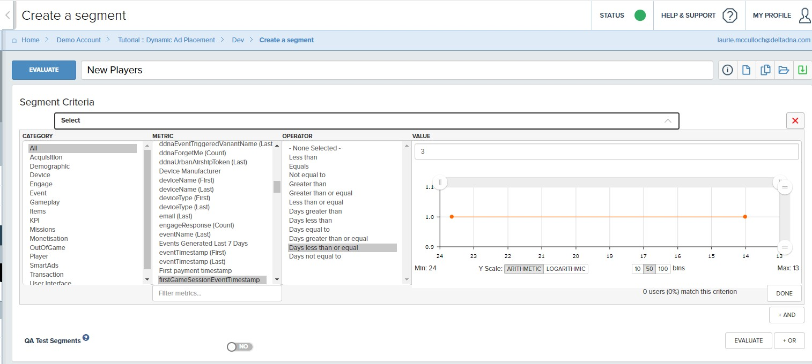

They will be shown an Image Message Popup encouraging them to visit the store and purchase a new player bundle containing 1000 coins. 

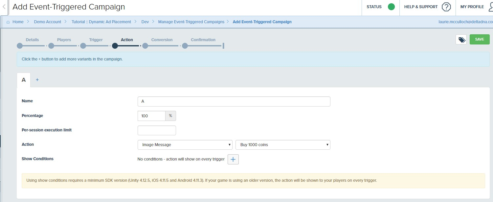

The Image Message Popup contains an image and a button that have been uploaded to deltaDNA. It has been configured to navigate the player to the App Store if they click the button, or dismiss the popup if they click the image background. 

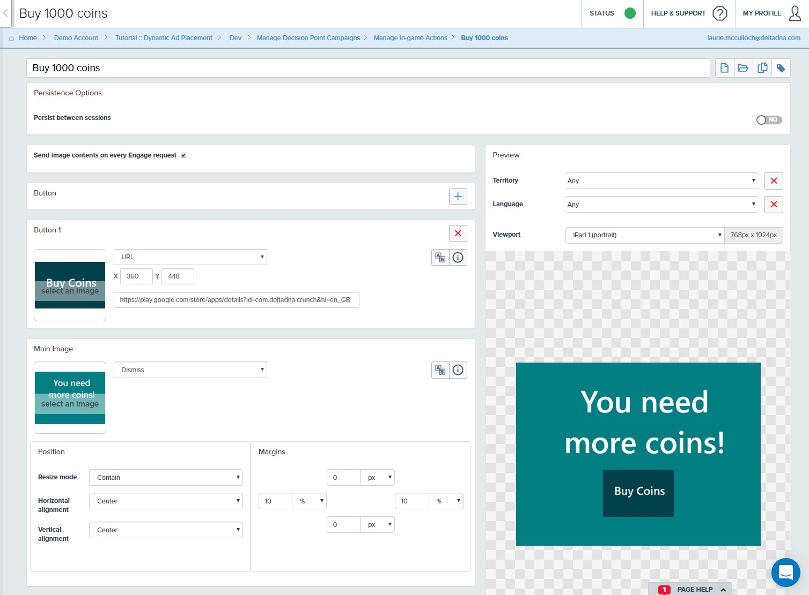

It also contains a Game Parameters block that specifies how many coins to give the player in return  for their purchase. 
*In reality you would redeem an IAP based on a store response, not on simply clicking the navigation button, but this is just a demo!* 


The campaign confirmation page looks like this. 

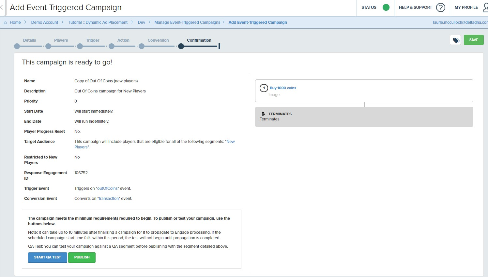

## Conclusion
It really is that simple! With just a few lines of code and some simple campaigns  it is possible to completely personalise your Ad strategy. The great thing is that you can measure the success and refine your implementation remotely without having to make changes to your game and go back through the submission process each time.  

Whilst the techniques above have used Unity Ads, the same methodology can be applied to other Ad Networks or Mediators. 

If you have any questions or suggestions for other tutorials, please contact support@deltadna.com